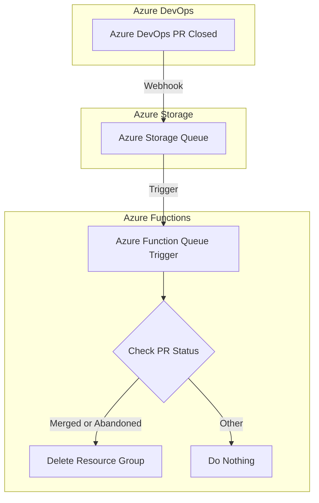

## Environment Remover

This functions app listens an a queue for tasks to delete resource groups in Azure.
The use case is that when a pull request has a pullrequest environment, this function shoulw delete the environment (resource group) when the PR is closed (merged or abandoned).



## Debugging


### 1. Upload message to storage queue

Once running, you can test the webhook queue trigger with a sample Azure DevOps PR event.
Sample events can be found in the test project in the class `TestData.cs`.
To use the blob storage queue, you can use Azure Storage Explorer or the [Azure Powershell module](https://learn.microsoft.com/en-us/powershell/azure/install-azure-powershell).

```pwsh
# You can get the connection string from the aspire dashboard, in the environment details of your function app
# Look for the environment variable "Aspire__Azure__Data__Tables__AzureWebJobsStorage__ConnectionString"
$connectionString = Read-Host "Enter Azure Storage connection string" -MaskInput
$context = New-AzStorageContext -ConnectionString $connectionString
$queue = Get-AzStorageQueue -Context $context -Name "azure-devops-queue"
# Copy here the data from the TestData class, for example TestData.PullRequestClosedEventJson
Write-Host "Enter sample PR event JSON (exit the mode with an empty line):"
$x = while (1) { read-host | set r; if (!$r) {break}; $r}
$message = [Convert]::ToBase64String([System.Text.Encoding]::UTF8.GetBytes($x))
# this sends the event to the queue, which will trigger the function
$queue.QueueClient.SendMessage($message)
```

#### Expected Response

- **200 OK**: Webhook processed successfully
  - Will not work in debugging mode, because of missing azure authentication
  - For completed (merged) PRs: Resource group would be deleted (if configured)
  - For abandoned PRs: Status logged
- **400 Bad Request**: Invalid JSON or missing required fields

### 2. Monitor in Aspire Dashboard

1. Navigate to the Aspire Dashboard (`http://localhost:18888`)
2. Find "environment-remover" in the resources list
3. Click to view:
   - Real-time logs
   - Health status
   - Performance metrics
   - Distributed traces

### 3. Azure Credentials for Local Development

For testing resource deletion locally with actual Azure resources:

```powershell
# Authenticate with Azure CLI
az login

# Verify subscription
az account show
```

The function uses `DefaultAzureCredential` which will use your Azure CLI credentials when running locally.

## Deployment

1. Define value `AzureSubscriptionId` parameter (see in the deployment docs how todo that)
2. Follow the [deployment instructions](../Deployment.md) to deploy the function to Azure.
3. After the deployment follow the next two main steps

### Configure Azure DevOps Webhook

1. Go to your Azure DevOps project
2. Navigate to Project Settings > Service Hooks
3. Create a new Subscription with the target Azure Storage
4. Settings for the trigger:
- Trigger on: "Pull request updated"
- Repository: Select the repository you want to monitor
- Target Branch: (optional) Specify if you want to trigger only for specific branches
- Leave the rest on Any
5. Settings for the azure queue:
- Go to the resource group that was created while the deployment the environment remover function
- Find the storage account in that resource group
- Fill in the connection information.
- The Queue name should be `azure-devops-queue`
- Leave the rest of the settings as default and create the subscription


### Configure Resource Group Deletion Permissions

- Go to the resource group that was created while the deployment the environment remover function
- Find the azure function app
- Find the "Identity" tab
- Copy the "Principal ID" in the system assigned section
- Go to the subscription that contains the resource groups you want to delete
- Go to "Access Control (IAM)"
- Add a new role assignment for the function app's managed identity with"Contributor" role at the subscription level

## Troubleshooting

### Resource Group Not Deleting

1. Verify `AZURE_SUBSCRIPTION_ID` is set correctly
2. Check that the managed identity has `Owner` or `Contributor` role on the subscription
3. Ensure the resource group name follows Azure naming conventions
4. Check function logs for error details

### Authentication Issues

```
DefaultAzureCredentialException: A credential object could not be created
```

Solutions:
- Run `az login` to authenticate with Azure CLI
- Or set up managed identity in Azure Function configuration
- Or provide service principal credentials via environment variables

### PR Event Not Processing

1. Verify the webhook event type is exactly `git.pullrequest.closed`
2. Check that the resource status is either `completed` (merged) or `abandoned`
3. Look at function logs to see what event types are being received
